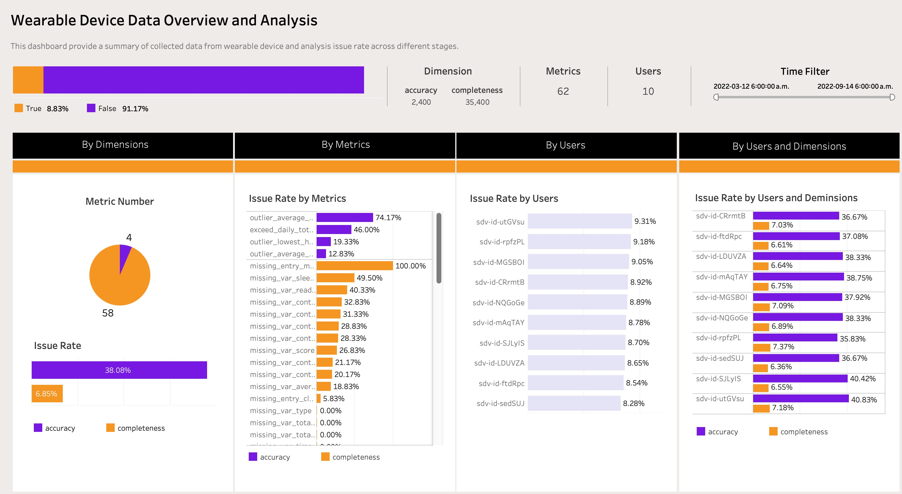
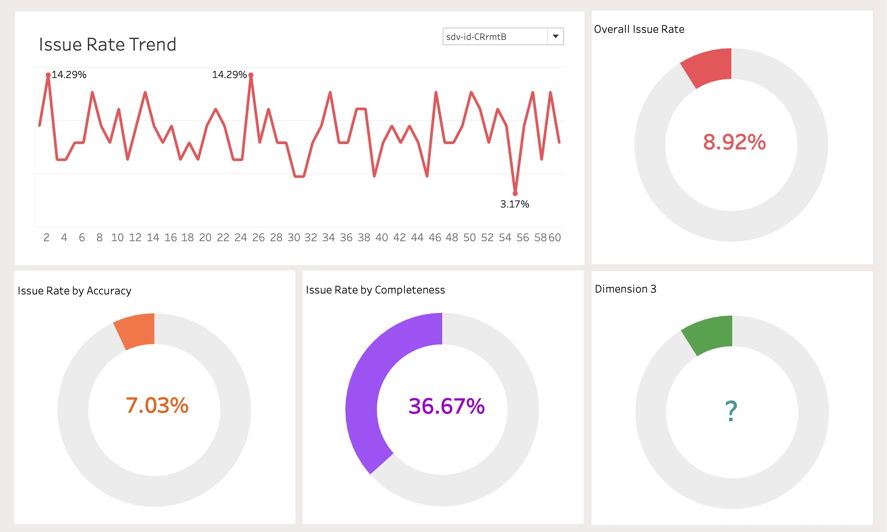
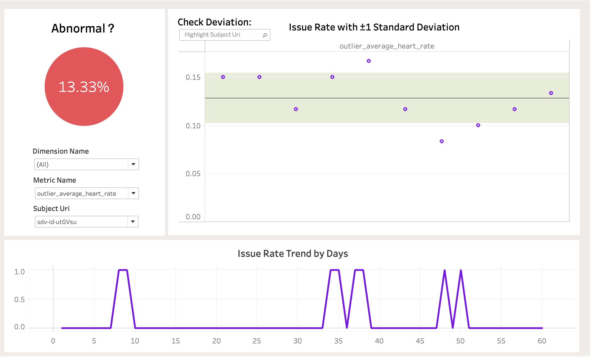

# 📊 Data Quality Analysis of Healthcare Wearable Devices

## 🧩 Project Overview
This project evaluates the data quality of a healthcare wearable device to identify issues affecting the reliability of recorded health metrics and support improvements in device performance.

---

## 🎯 Objectives
- Assess data completeness and accuracy across key metrics  
- Identify patterns of missing or inconsistent data  
- Provide actionable insights to improve data reliability  

---

## 📦 Dataset
The dataset contains data quality measurements across multiple health metrics, including:
- Category and dimension information  
- Metric names  
- Timestamps for trend analysis  
- Subject-related attributes  

---

## 🛠️ Tools & Technologies
- Python (pandas)  
- Tableau  
- SQL (for data querying logic)

---

## ⚙️ Methodology
1. Data cleaning and preprocessing  
2. Definition of key metric: `issue_rate`  
3. Exploratory data analysis (EDA)  
4. Time-series analysis  
5. Dashboard development in Tableau  

---

## 🔍 Key Insights
- Most metrics show high reliability with near-zero issue rates  
- Movement-related metrics have higher issue rates, likely due to sensor or activity factors  
- Sleep and readiness metrics show higher missing rates  
- Heart rate metrics contain anomalies that may indicate measurement inconsistencies  

---

## 🚀 Business Recommendations
- Improve movement tracking accuracy during active conditions  
- Enhance data collection for sleep-related metrics  
- Investigate heart rate anomalies for better reliability  
- Use dashboards for continuous monitoring and improvement  

---

## 📊 Dashboard Preview

---

## 💡 Key Takeaway
This project demonstrates how data analysis can identify quality issues in healthcare devices and support data-driven product improvements.
